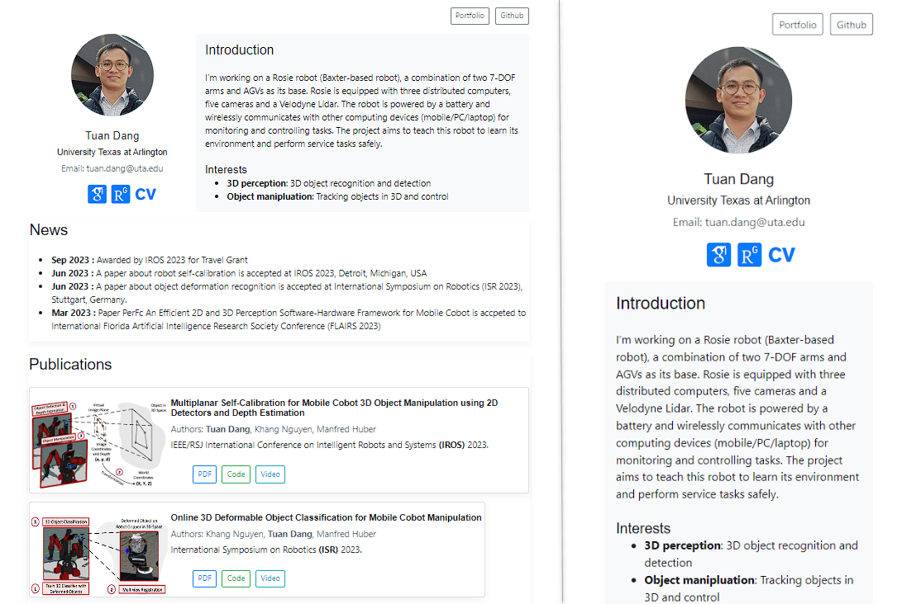

# Academic Website

This repository contains source code of my academic website purely made layout with boostrap.
See demo at [https://tuandang.info](https://tuandang.info/) using Jekyll as a static website generator. Feel free to clone this code for your personal use!

<p align="center">
  <br/>
</p>


## Prerequisites

* [Ruby with DevKit](https://rubyinstaller.org/downloads/) (version in use 3.2.2-1)
* [Jekyll](https://jekyllrb.com/) (version  in use 4.3.2).

After installing Ruby, Jekyll can be installed via the following command:

```
gem install bundler jekyll 
```

Now, you can use Jekyll locally as a website (static) generator on your laptop.

<!-- USAGE -->

## Usage

### Clone the repository

```
git clone https://github.com/tuantdang/academic-website.git
cd academic-website
```

### Customize personal information

When opening the code from an IDE, you should see a structure like this:

```
.
├───assets                      # folder including your images, files, etc
├───_data                       # yaml static data              
├───_layouts      
|   └───default.html            # the default layout  
├───_site                       # static output for deployment
├───index.md                    # file to generate index.html
|───portfolio.md                # file to generate portfolio.html
└───_config.yml                 # information for webpage title and favicon
```

You can modify the `_config.yml` file to your information:

### Add moore page
You can add more papges like portofiio.md to generate portofiio.html in folder _site.

###  Run the webpage at localhost

After changing to your information, the website can be tested using the following command:

```
bundle exec jekyll server
```

You can either see the web version in the `_site/index.html` file or go to your `localhost`: [http://localhost:4000](http://localhost:4000).

## Deploy the webpage at your desired host
Copy folder _site to your host and enjoy!

